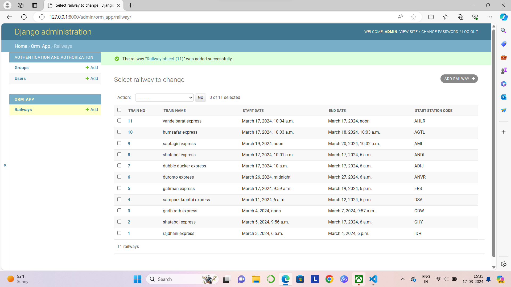
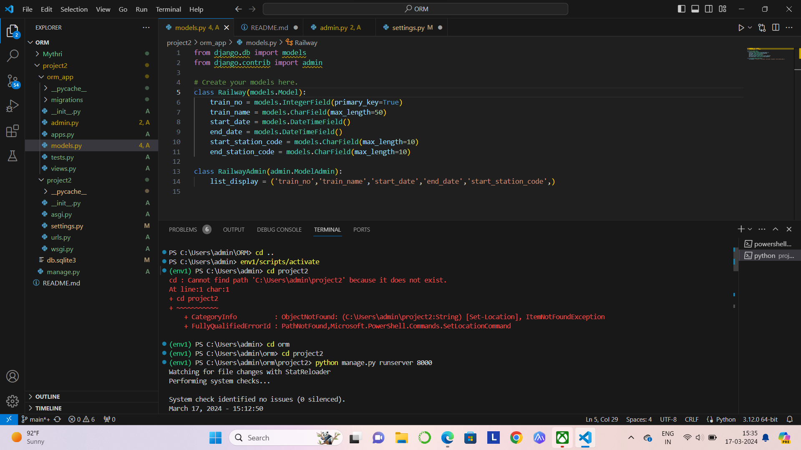

# Ex02 Django ORM Web Application
## Date: 

## AIM
To develop a Django application to store and retrieve data from a Book database using Object Relational Mapping(ORM).

## Entity Relationship Diagram

Include your ER diagram here

## DESIGN STEPS

### STEP 1:
Clone the problem from GitHub

### STEP 2:
Create a new app in Django project

### STEP 3:
Enter the code for admin.py and models.py

### STEP 4:
Execute Django admin and create details for 10 books

## PROGRAM
```
from django.db import models
from django.contrib import admin

# Create your models here.
class Railway(models.Model):
    train_no = models.IntegerField(primary_key=True)
    train_name = models.CharField(max_length=50)
    start_date = models.DateTimeField()
    end_date = models.DateTimeField()
    start_station_code = models.CharField(max_length=10)
    end_station_code = models.CharField(max_length=10)

class RailwayAdmin(admin.ModelAdmin):
    list_display = ('train_no','train_name','start_date','end_date','start_station_code',)

from django.contrib import admin
from .models import Railway, RailwayAdmin
# Register your models here.
admin.site.register(Railway, RailwayAdmin)
```
## OUTPUT



## SERVER OUTPUT:



## RESULT
Thus the program for creating a database using ORM hass been executed successfully
